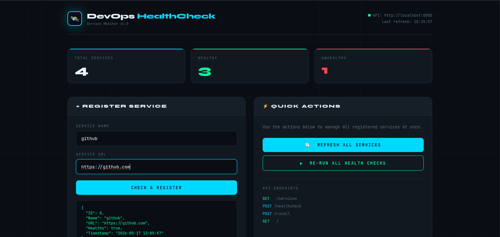
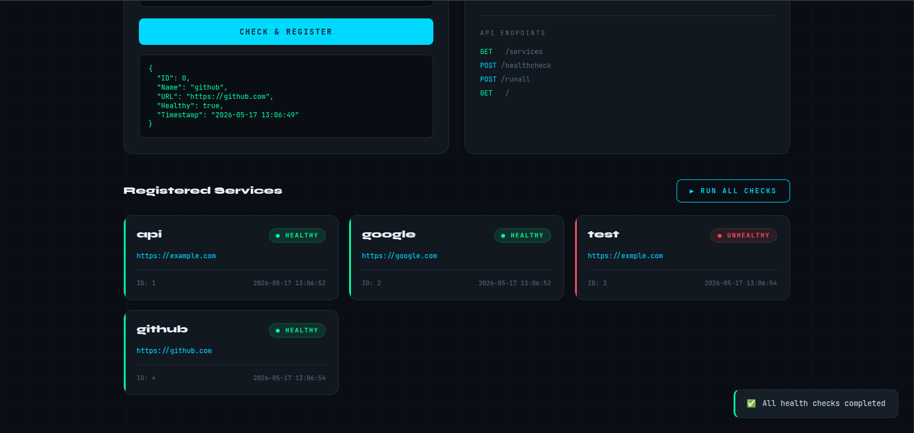

# 🚀 Go Service Healthcheck Monitor

A production-ready service health monitoring system built with **Go**, **PostgreSQL**, **Docker**, and a custom dark-themed UI dashboard — with a full CI/CD pipeline that automatically builds and pushes Docker images to DockerHub on every push to `main`.

---

## 🎨 UI Screenshots

### Dashboard Overview


### Services & Health Status


---

## ✨ Features

- ✅ Full **CRUD** operations on services
- ✅ **Real-time health checks** via HTTP GET
- ✅ **PostgreSQL** persistent storage via Docker
- ✅ **Dark-themed UI dashboard** served via Nginx
- ✅ **REST API** with 6 endpoints
- ✅ **CI/CD pipeline** — auto build, tag, push to DockerHub, update `docker-compose.yml`
- ✅ Single command to run everything: `docker-compose up`

---

## 🛠️ Tech Stack

| Layer       | Technology                  |
|-------------|-----------------------------|
| Backend     | Go (net/http)               |
| Database    | PostgreSQL                  |
| Frontend    | HTML, CSS, Vanilla JS       |
| Web Server  | Nginx (Alpine)              |
| Container   | Docker + Docker Compose     |
| CI/CD       | GitHub Actions              |
| Registry    | DockerHub                   |

---

## 📁 Project Structure

```
go-api-healthcheck-monitor/
├── main.go                   # HTTP server & CRUD route handlers
├── go.mod
├── go.sum
├── Dockerfile                # Multi-stage build for Go backend
├── Dockerfile.ui             # Nginx image for UI
├── docker-compose.yml        # Postgres + App + UI together
├── nginx.conf                # Nginx config
├── ui.html                   # Frontend dashboard
├── db/
│   └── db.go                 # PostgreSQL connection & table setup
├── models/
│   └── service.go            # Service struct & CheckHealth()
├── colorprint/
│   └── print.go              # Color terminal output
└── .github/
    └── workflows/
        └── deploy.yml        # CI/CD pipeline
```

---

## 🐳 Run with Docker Compose

```bash
docker-compose up
```

| Service     | URL                   | Description        |
|-------------|-----------------------|--------------------|
| UI          | http://localhost:3000 | Frontend dashboard |
| Backend API | http://localhost:8080 | Go HTTP server     |
| PostgreSQL  | localhost:5432        | Database           |

---

## 🛣️ API Routes (CRUD)

| Method   | Route               | Description                     |
|----------|---------------------|---------------------------------|
| `GET`    | `/`                 | Home                            |
| `POST`   | `/healthcheck`      | Create — register & check service |
| `GET`    | `/services`         | Read — get all services         |
| `GET`    | `/services/{name}`  | Read — get one service          |
| `PUT`    | `/services/{name}`  | Update — edit & re-check        |
| `DELETE` | `/services/{name}`  | Delete — remove service         |
| `POST`   | `/runall`           | Re-run health checks on all     |

---

## 🧪 Test with curl

```bash
# Create
curl -X POST http://localhost:8080/healthcheck \
  -H "Content-Type: application/json" \
  -d '{"Name":"google","URL":"https://google.com"}'

# Read all
curl http://localhost:8080/services

# Read one
curl http://localhost:8080/services/google

# Update
curl -X PUT http://localhost:8080/services/google \
  -H "Content-Type: application/json" \
  -d '{"Name":"google","URL":"https://www.google.com"}'

# Delete
curl -X DELETE http://localhost:8080/services/google

# Re-run all
curl -X POST http://localhost:8080/runall
```

---

## 🗄️ Database Schema

```sql
CREATE TABLE IF NOT EXISTS services (
    id        SERIAL PRIMARY KEY,
    name      VARCHAR(100) UNIQUE,
    url       VARCHAR(255),
    healthy   BOOLEAN,
    timestamp VARCHAR(50)
);
```

---

## ⚙️ CI/CD Pipeline

The GitHub Actions pipeline triggers on every push to `main`:

```
Push to main
     │
     ▼
Checkout code
     │
     ▼
Generate image tag (git short SHA)
     │
     ▼
Login to DockerHub
     │
     ├──▶ Build & push backend image
     │         dipakrasal2009/devops-healthcheck-app:<tag>
     │
     ├──▶ Build & push UI image
     │         dipakrasal2009/devops-healthcheck-ui:<tag>
     │
     ▼
Update docker-compose.yml with new tags
     │
     ▼
Commit & push docker-compose.yml back to repo [skip ci]
```

### Pipeline file: `.github/workflows/deploy.yml`

### Required GitHub Secrets

Go to **Settings → Secrets and variables → Actions** and add:

| Secret | Value |
|--------|-------|
| `DOCKERHUB_USERNAME` | your DockerHub username |
| `DOCKERHUB_TOKEN` | your DockerHub access token |

### Required GitHub Permission

Go to **Settings → Actions → General → Workflow permissions**:
```
✅ Read and write permissions
```

---

## 🔧 Local Development (Without Docker)

```bash
# Start PostgreSQL
docker run --name devops-pg \
  -e POSTGRES_USER=admin \
  -e POSTGRES_PASSWORD=admin123 \
  -e POSTGRES_DB=healthcheck \
  -p 5432:5432 -d postgres

# Install dependencies
go mod tidy

# Run backend
go run main.go

# Open UI
python3 -m http.server 3000
# Then open http://localhost:3000/ui.html
```

---

## 🗄️ Useful DB Commands

```bash
# View all services
docker exec -it devops-pg psql -U admin -d healthcheck -c "SELECT * FROM services;"

# Only healthy
docker exec -it devops-pg psql -U admin -d healthcheck -c "SELECT * FROM services WHERE healthy=true;"

# Only unhealthy
docker exec -it devops-pg psql -U admin -d healthcheck -c "SELECT * FROM services WHERE healthy=false;"

# Drop table (fresh start)
docker exec -it devops-pg psql -U admin -d healthcheck -c "DROP TABLE IF EXISTS services;"
```

---

## 🔧 Troubleshooting

**App can't reach database**
```bash
docker-compose down && docker-compose up
```

**Old volume causing PostgreSQL errors**
```bash
docker-compose down -v && docker-compose up
```

**Pipeline 403 error on git push**
Go to repo **Settings → Actions → General → Workflow permissions → Read and write permissions**

---

## 📦 Dependencies

| Package                  | Purpose                  |
|--------------------------|--------------------------|
| `github.com/lib/pq`      | PostgreSQL driver for Go |
| `github.com/fatih/color` | Colored terminal output  |

---

## 🐳 DockerHub Images

| Image | Link |
|-------|------|
| Backend | `dipakrasal2009/devops-healthcheck-app` |
| UI | `dipakrasal2009/devops-healthcheck-ui` |